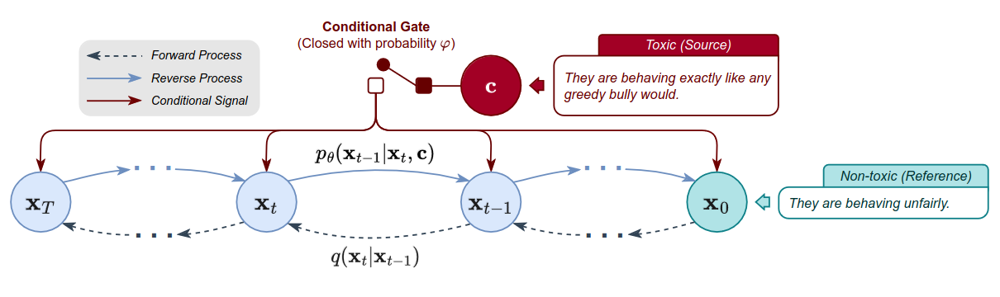

# DiffuDetox

Implimentation of [DiffuDetox](https://aclanthology.org/2023.findings-acl.478.pdf), based on [DiffuSeq](https://github.com/Shark-NLP/DiffuSeqhttps://arxiv.org/abs/2210.08933).

<p align="center">
  
</p>

## Datasets
DiffuDetox datasets are small enough to be directly included in the ``datasets`` folder.

## Requirements:
The code is based on PyTorch and HuggingFace `transformers`. After creating a virtual environment, run:
```bash 
pip install -r requirements.txt 
```

## Training
The training script is launched in the ``scripts`` folder.
```bash
cd scripts
bash train.sh
```
Arguments explanation:
- ```--dataset_unsup```: the name of unsupervised dataset to suppliment Paradetox  
- ```--folder_name```: the name of the results directory.
- ```--data_dir```: the path to the saved datasets folder, containing ```.jsonl``` files
- ```--resume_checkpoint```: if not none, restore this checkpoint and continue training
- ```--vocab```: the tokenizer is initialized using bert or load your own preprocessed vocab dictionary (e.g. using BPE)

## DiffuDetox Decoding
You need to modify the path to ```model_dir```, which is obtained in the training stage.
```bash
cd scripts
bash run_decode.sh
```

## Evaluation & MBR
You need to specify the folder of decoded texts. This folder should contain the decoded files from the same model but sampling with different random seeds.

```bash
cd scripts
python eval_seq2seq.py --folder ../{your-path-to-outputs} --mbr
```

